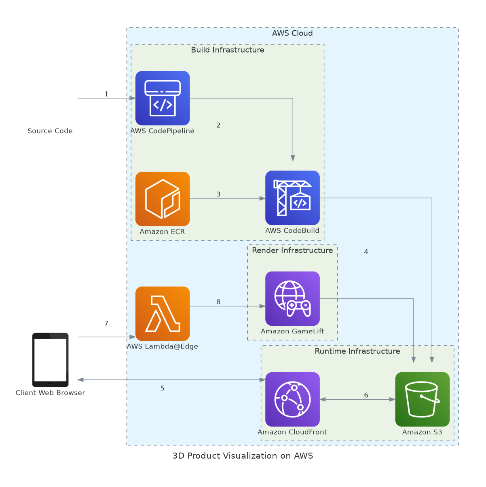

# devops-docs

A Claude Skill for writing operational and infrastructure documentation that a stranger can actually use.

## The problem

Ask an AI to document your infrastructure and you get 2,000 lines explaining what Terraform is, listing every resource block, walking through the happy path, and closing with a Best Practices section that says "monitor your services." Nobody reads it. When the pager goes off at 3am, it is useless.

The failure has a specific cause. Generated docs assume the reader is unfamiliar with **the tools**. The reader is actually unfamiliar with **your system**. So you get a paragraph on `kubectl` and nothing about the fact that this service takes 90 seconds to pass health checks because it warms a cache on boot — so the on-call engineer waits 30 seconds, concludes the deploy is broken, and rolls back a healthy release.

This skill corrects that. Every rule in it exists to keep Claude writing about your system instead of about the industry.

## What it writes

| Type | For |
|---|---|
| **Infrastructure doc** | Terraform / OpenTofu / CDK / Pulumi — diagram, component costs, blast radius, state, DR |
| **Pipeline doc** | GitHub Actions, GitLab CI, Jenkins, Argo — stages, gates, durations, CI cost, rollback |
| **Unified platform doc** | All of the above at once — and the seams between them |
| **Runbook** | Symptom-indexed incident response with confirm / fix / blast radius per failure mode |
| **Service doc** | What this thing is, what it depends on, what breaks when you touch it |
| **Postmortem** | Incident writeups that produce changes rather than paperwork |
| **ADR** | Decisions, and why they were made |
| **On-call onboarding** | First shift without messaging anyone at 3am |
| **Review** | Trimming docs that already exist, including AI-generated ones |

**When a repo has CI/CD *and* IaC *and* Ansible *and* Kubernetes, it writes one document, not four.** The value is in the seams — how Terraform's outputs reach Ansible's inventory, whether CI applies or Argo syncs, which layer owns which resource. Four separate documents describe four tools; none of them answers "I changed a variable, why didn't it take effect?"

## Architecture diagrams, generated from a spec

Diagrams come from a checked-in YAML spec, so they can be reviewed in a pull request and regenerated when the infrastructure changes. A hand-placed diagram in a tool nobody else can open is wrong within two months, and a wrong diagram is worse than none because people plan against it.



```bash
python3 scripts/gen_diagram.py docs/architecture.yaml -o docs/architecture
python3 scripts/gen_diagram.py docs/pipeline.yaml --backend mermaid   # zero dependencies
```

The default backend produces the provider-icon style used by AWS, GCP, and Azure reference architectures. The Mermaid backend needs nothing at all and renders natively in GitHub and GitLab.

## Cost, without invented numbers

Cost is the section most likely to contain confident fabrication — plausible prices are easy to generate and hard for a reader to check, and a wrong figure ends up in a budget request.

The skill will not state a price from memory. It uses your billing data, `infracost`, or the provider's current pricing page — or it writes a TODO. Every figure carries region, date, pricing model, and source. It also flags the costs that consistently blindside teams: NAT gateway data processing, cross-AZ transfer, log ingestion, orphaned snapshots, and non-production environments nobody turns off at night.

`assets/data/cost-anchors.csv` ships deliberately **unpopulated**. A skill whose central rule is "never state a price from memory" cannot also ship a price table that goes stale the day it is committed.

## Safety

Documenting infrastructure means reading the parts of a repo where credentials live. The constraints are enforced in code, not just in instructions:

- **Never opened:** `.env`, `*.tfstate` (Terraform state stores every secret in plaintext regardless of `sensitive`), `*.tfvars`, key material, kubeconfigs, Ansible Vault files, Kubernetes `Secret` manifests. They are reported as present-but-not-read so the doc can acknowledge them without their contents entering context.
- **Never run:** `terraform apply|destroy|import`, `kubectl apply|delete`, `helm upgrade`, `ansible-playbook` without `--check`, or any cloud CLI mutation. `terraform plan` needs asking first — it takes a state lock and hits real APIs.
- **Never installed:** if Graphviz or `infracost` is missing, the script prints the install command and stops. It does not run a package manager on your machine.
- **Checked before delivery:** `scripts/check_doc.py` scans the finished document for credential patterns and fails non-zero, so it can go in CI or a pre-commit hook.

See [SECURITY.md](SECURITY.md) for the limits of these mechanisms.

## The rules it enforces

**Writes for:** a competent engineer who has never touched this system, reading at 3am, under pressure, with the author unreachable.

**Always:** read the actual code before writing · mark gaps as `TODO(owner)` rather than inventing plausible content · index by symptom, not architecture · show expected output for every diagnostic command · state blast radius before every destructive action · number diagram edges and have prose refer to them · name who to escalate to.

**Never:** invent a command, flag, path, metric, price, or dashboard URL · explain Docker or Kubernetes · narrate the code · write generic Best Practices sections · document only the happy path · put a credential value in output, even masked.

It also enforces **length budgets** — infra doc 500 lines, runbook 400, ADR 2 pages — on the principle that hitting the ceiling means the doc should be split, not that it's finished.

## Install

**Claude Code:**

```
/plugin marketplace add Gokulkrishna07/claude-devops-docs
/plugin install devops-docs
```

**Any Claude surface:** copy `skills/devops-docs/` into `~/.claude/skills/` (personal) or `.claude/skills/` in your repo (shared with the team). Or upload `devops-docs.skill` in Claude.ai's skill settings.

**Optional tools**, installed by you, not by the skill:

```bash
pip install diagrams pyyaml     # provider-icon diagrams
brew install graphviz           # or apt-get / dnf / winget
brew install infracost          # real cost figures
```

Everything works without them — diagrams fall back to Mermaid, costs fall back to TODOs.

## Use

It triggers on its own. Prompts that work well:

```
Document our infrastructure. Terraform is in ./infra, we deploy with
Jenkins and Argo. Include the architecture diagram and monthly cost.

Write the runbook for the payments service. Ask me anything the code
can't tell you.

Review docs/platform.md — it's 1,800 lines of AI slop. Cut it down and
tell me what you dropped.

We had an incident: replica lag hit 40 minutes during the nightly batch
and reads served stale data for 2 hours. Write the postmortem.
```

Expect a batch of questions before it writes — ownership, real observed failures, what breaks when each dependency fails, data-loss risks. That interview is where the value comes from. Anything you don't answer becomes a visible TODO rather than invented content.

## Contributing

Failure modes are the most valuable contribution. If one has actually bitten you in production, add it to `references/failure-modes.md` in the existing seven-field format. See [CONTRIBUTING.md](CONTRIBUTING.md) — and strip your employer's hostnames before you push.

## License

MIT
